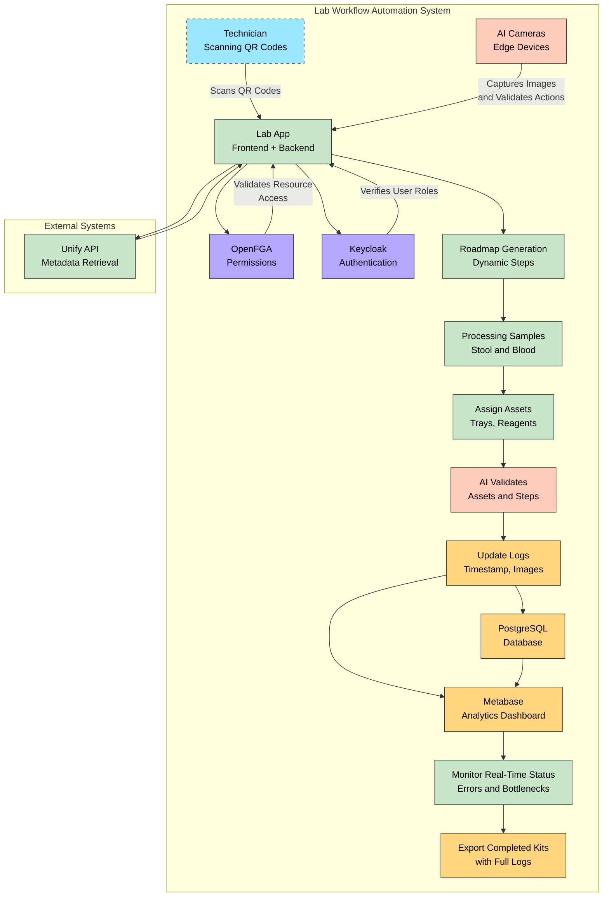

### Project Instructions: AI-Powered Lab Workflow Automation

#### Overview
This document provides comprehensive instructions for developers on building an AI-powered lab workflow automation app. The system will streamline lab processes, reduce human error, and ensure complete traceability using AI cameras, a flexible permission system (OpenFGA), robust authentication (Keycloak), a PostgreSQL database, and Metabase for analytics and reporting. 

### 1. Purpose and Scope
The application’s primary goal is to create an efficient, error-proof lab workflow. It will automate tracking, labeling, logging, and visual validation of sample handling and processing. All activities will be securely managed, traceable, and compliant with regulatory requirements. The app will:

1. Automate the processing of lab samples (stool, blood, etc.).
2. Track and manage assets with QR codes.
3. Log every action with visual evidence (AI camera snapshots).
4. Provide a secure and auditable chain of custody for each sample.
5. Integrate seamlessly with laboratory systems using APIs.

### 2. System Components

#### Core Technologies
- **OpenFGA**: For implementing a flexible and scalable permission system.
- **Keycloak**: To manage authentication and user roles securely.
- **PostgreSQL**: As the primary database for all data storage.
- **Metabase**: For analytics, reporting, and visualizing lab performance metrics.
- **AI Cameras**: To capture and verify actions in real-time.

### 3. Detailed Workflow

#### Sample Arrival and Registration
1. Samples (kits) arrive at the lab, each marked with a unique QR code.
2. The QR code is scanned at the registration desk.
3. Upon scanning, the system retrieves the metadata (sample type, required steps) using the Unify API.
4. Registration details are saved in PostgreSQL.
5. User authentication and role-based access are verified via Keycloak to ensure only authorized personnel can register kits.

#### Roadmap Generation
1. Scanning the kit’s QR code automatically generates a step-by-step roadmap based on the sample type.
2. The roadmap includes:
   - Required tasks (e.g., centrifuge, freezing).
   - Required assets (trays, tubes, reagents).
   - Approximate durations and sequencing of steps.
   - Expiration or compliance alerts (e.g., reagent expiry).
3. The roadmap is dynamically updated as tasks are completed.

#### Sample Processing
1. **Stool Samples:**
   - Transfer to smaller tubes.
   - Add a reagent (e.g., LTS Euffer).
   - Place in the centrifuge.
   - Move to the designated freezer.
2. **Blood Samples:**
   - If pre-processed: move directly to freezer storage.
   - If not pre-processed: follow roadmap steps for centrifuge or other processes, then freeze.

#### Asset Management
1. All equipment, trays, reagents, and storage units are registered as assets in the system with unique QR codes.
2. The system tracks:
   - Equipment usage.
   - Reagent lot numbers, expiration dates, and quantities.
   - Asset assignments to workflows.
3. Permissions for accessing or modifying assets are managed via OpenFGA.

#### Execution and Logging
1. Technicians scan QR codes to assign assets to tasks (e.g., trays, tubes).
2. AI cameras monitor actions and capture timestamped images at every critical step.
3. Logs include:
   - Task details.
   - Assigned assets.
   - Captured images and timestamps.
4. The system validates correctness using AI (e.g., ensures correct reagent is used).
5. Logs are stored securely in PostgreSQL and linked to the kit ID.

#### Movement and Tracking
1. Each roadmap step includes a location checkpoint (e.g., centrifuge, freezer).
2. AI cameras or QR scanners log the physical movement of samples and assets.
3. When additional resources are required, the system prompts for scanning and logs usage and location.

#### Real-Time Monitoring and Visualization
1. A dashboard powered by Metabase displays:
   - Current workflow status.
   - Delays, deviations, and bottlenecks.
2. Alerts notify technicians of errors or missed steps.
3. Visual feedback ensures complete transparency and traceability of sample processing.

#### Completion and Export
1. Once all roadmap steps are completed, the kit is marked as “Ready for Export.”
2. A complete chain of custody, including logs and images, is stored in PostgreSQL.
3. Data is accessible for audits, compliance checks, and reports.

### 4. Features and Requirements

#### Authentication and Permissions
- Use Keycloak to manage user authentication and roles.
- Implement OpenFGA for fine-grained permissions for accessing tasks, assets, and sensitive workflows.

#### Data Storage
- PostgreSQL will store:
  - Kit metadata.
  - Roadmap details.
  - Asset information.
  - Task logs and images.
- Ensure database indexing and optimization for fast retrieval.

#### Analytics
- Use Metabase to:
  - Track processing times, resource utilization, and bottlenecks.
  - Generate periodic reports for lab managers.
  - Provide real-time performance insights.

#### AI Camera Integration
- Deploy AI cameras to:
  - Capture actions at checkpoints.
  - Validate correct reagent/equipment usage.
  - Provide timestamped visual evidence.

#### Compliance and Audit Trail
- Ensure all logs and images are stored in read-only format for compliance.
- Retain data according to regulatory requirements (e.g., CAP, CLIA, ISO).

#### Scalability
- Utilize cloud-based services for data storage and processing.
- Implement edge computing for real-time AI camera processing to reduce latency.

#### Exception Handling
- Develop fallback workflows for network or hardware failures (e.g., manual QR scanning, offline data caching).
- Automatically generate incident reports for deviations from standard protocols.

### 5. Development and Deployment Steps

#### Initial Setup
1. Configure PostgreSQL database with necessary schemas (kits, assets, logs, roadmaps).
2. Deploy Keycloak for authentication and role management.
3. Set up OpenFGA for permission handling.
4. Install and configure Metabase for analytics and reporting.

#### AI Integration
1. Train machine learning models for AI camera verification.
2. Deploy cameras and integrate them with the system for capturing images and validating actions.

#### API Integration
1. Integrate the Unify API for retrieving metadata and synchronizing with existing lab systems.
2. Build RESTful APIs for internal communication between components.

#### Frontend and Dashboard
1. Develop a user-friendly interface for:
   - Scanning QR codes.
   - Viewing roadmaps and logs.
   - Monitoring real-time workflow status.
2. Use Metabase to design dashboards for analytics and reporting.

#### Testing and Validation
1. Conduct end-to-end testing of workflows, including:
   - Roadmap generation.
   - Asset tracking and logging.
   - AI camera integration.
2. Validate system compliance with regulatory standards.

### 6. Deliverables
- Fully functional AI-powered lab workflow app.
- Secure database with traceable logs and audit trails.
- Analytics dashboard for performance tracking.
- Comprehensive documentation for system usage and maintenance.

  

